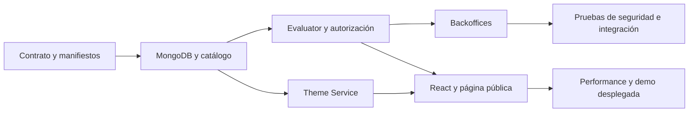

# Backlog operativo — Módulos dinámicos

El backlog oficial vive en el [dashboard GitHub de módulos dinámicos](https://github.com/orgs/aurea-io/projects/1) y dentro del milestone [Sistema de módulos dinámicos](https://github.com/aurea-io/aurea-pages-template/milestone/1).

## Regla de estados

Los estados se representan con labels para que puedan filtrarse desde Issues:

| Estado | Label | Uso |
| --- | --- | --- |
| Backlog | `status:backlog` | Tarea definida, sin comenzar |
| Features | `status:features` | Análisis o implementación funcional |
| Working | `status:working` | Desarrollo activo |
| Testing | `status:testing` | Implementación lista para validar |
| Done | Issue cerrada | Criterios y evidencia aprobados |

Las categorías adicionales (`area:*`) y tipos (`type:*`) permiten construir vistas por dominio sin mezclar catálogo, acceso, backoffice, frontend, themes y operación.

## Criterio obligatorio de cierre

Una tarea no se cierra por tener código mergeado. Debe incluir en la issue:

- captura o video de la funcionalidad real en un entorno desplegado;
- URL visible o identificable y entorno utilizado;
- flujo completo y resultado esperado;
- commit o PR asociado y pasos para reproducir;
- request/response sanitizado cuando se trate de una API.

La evidencia debe mostrar el producto funcionando, no únicamente tests locales, mocks, código o una captura del editor.

## Dependencias sugeridas



## Cómo trabajar

1. Tomar una issue del milestone y moverla a `status:working` al comenzar.
2. Asociar el PR con `Closes #N` solo cuando el cambio esté listo para validación.
3. Mover a `status:testing` al desplegar el entorno de prueba.
4. Adjuntar evidencia real y resultados de aceptación.
5. Cerrar únicamente después de revisar la evidencia y retirar el label de estado anterior.

## Dependencias entre tareas

Cada issue tiene una sección `Dependencias de ejecución` con sus bloqueantes concretos (`#N`). La regla de avance es:

```text
Contrato y manifiestos
        ↓
Modelo y catálogo MongoDB
        ↓
Evaluator, roles y autorización
        ↓
Backoffices + React público + Theme Service
        ↓
Seguridad, integración, performance y operación
        ↓
Demo desplegada y cierre
```

Una tarea no debe pasar a `Working` mientras una dependencia funcional siga abierta o sin evidencia aprobada. Las dependencias están duplicadas en el texto de las issues para conservar trazabilidad aunque cambie la vista del Project.

## Repositorios de implementación

- [Backend](https://github.com/aurea-io/backoffice-be-aurea): API, MongoDB, guards, evaluator y Theme Service.
- [Frontend](https://github.com/aurea-io/backoffice-fe-aurea): backoffices, React, capabilities y página pública.
- [Template POC](https://github.com/aurea-io/aurea-pages-template): documentación, contratos, backlog y referencia visual.

Las 33 issues abiertas del milestone son la descomposición ejecutable de la documentación vigente. Las issues 34–41 fueron cerradas como duplicadas durante la carga automática.
