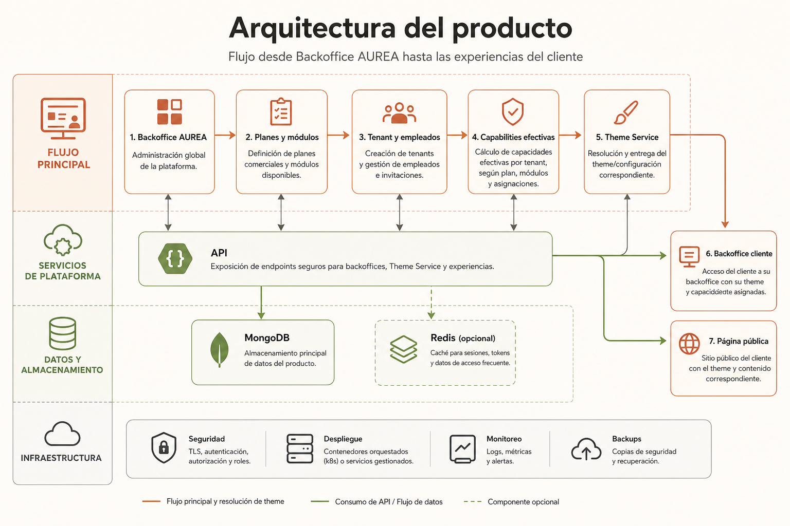
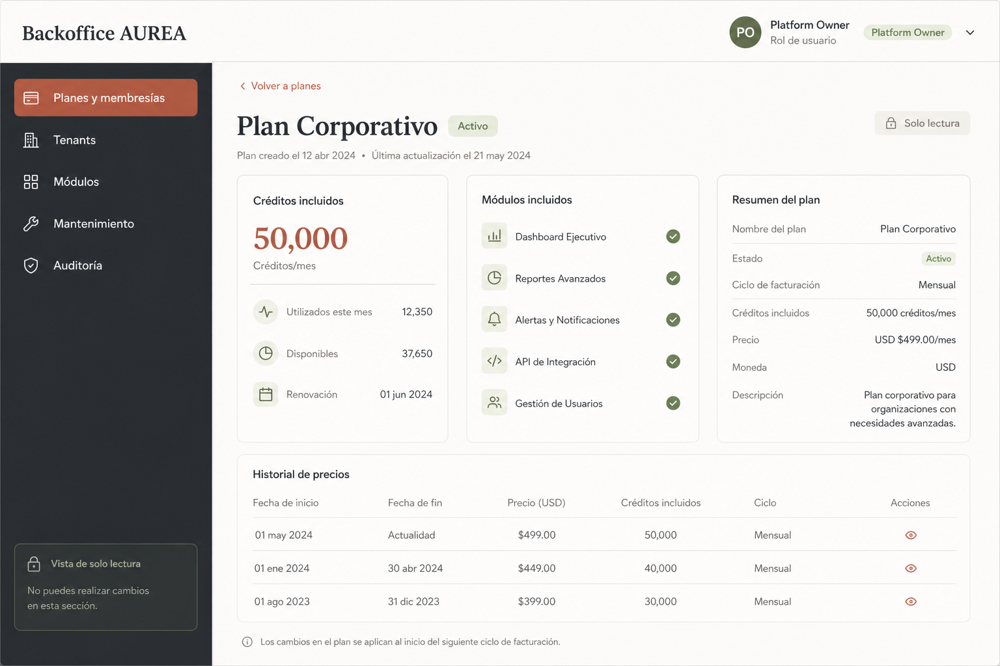
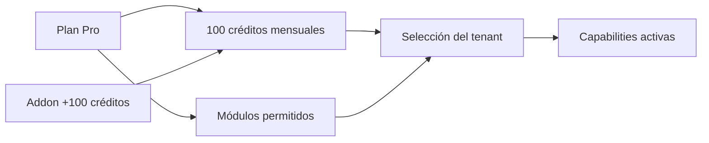
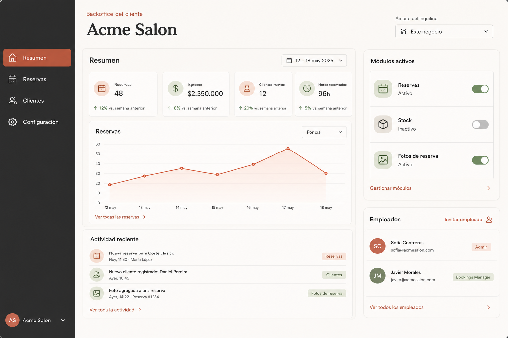
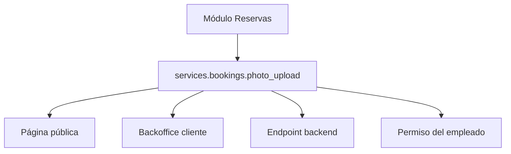
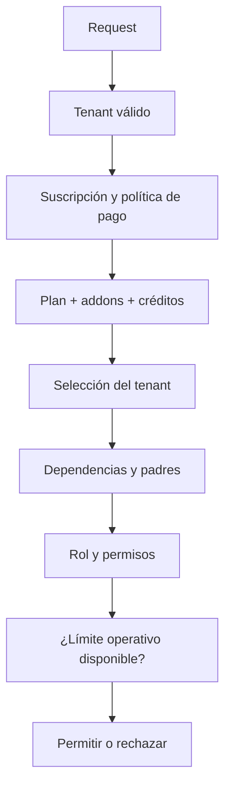
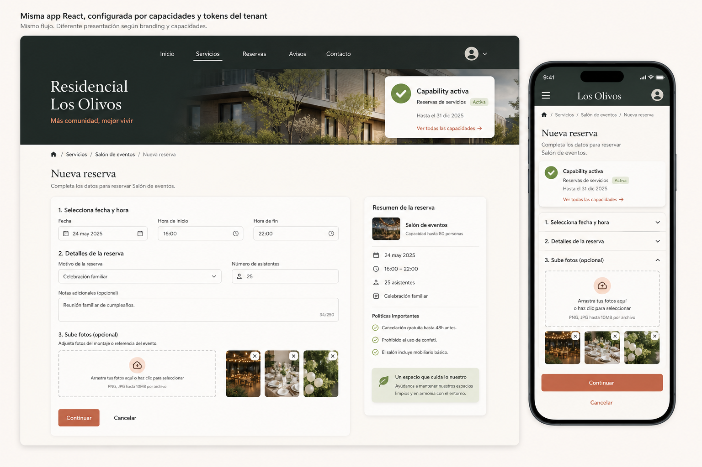
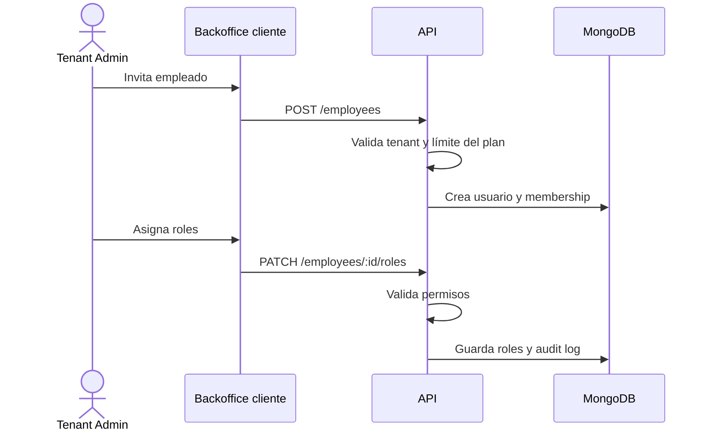
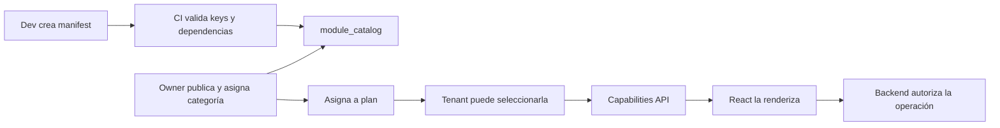

# Flujo completo — módulos dinámicos de Aurea

Este documento explica el recorrido completo del sistema: cómo AUREA define los módulos, cómo un plan los habilita, cómo un tenant los selecciona y cómo la misma aplicación React construye el backoffice y la página pública.

## La idea en una frase

```text
Una sola aplicación React + módulos reutilizables + configuración por tenant
```

Cada empresa utiliza la misma base de código, pero puede tener diferentes módulos, funciones, roles, créditos, contenido y estilos visuales.

## Vista general



El sistema tiene cuatro niveles principales:

```text
1. AUREA define qué existe
2. El plan define qué puede contratarse
3. El tenant elige qué activa
4. React y el backend aplican el resultado
```

## 1. Backoffice AUREA

El backoffice AUREA administra la plataforma completa, no la operación diaria de cada negocio.



Desde este espacio se gestionan:

- planes y membresías;
- precios e historial de precios;
- créditos mensuales;
- módulos incluidos en cada plan;
- addons;
- tenants;
- categorías y catálogo de módulos;
- mantenimiento global;
- usuarios y roles de plataforma;
- auditoría.

Los roles de plataforma se mantienen separados de los roles de los clientes:

```text
platform_owner
platform_readonly
```

Un usuario `platform_readonly` puede consultar la información, pero no modificar planes, módulos, tenants ni precios.

## 2. Plan, addons y créditos

Un plan puede habilitar un conjunto de módulos y entregar una cantidad de créditos.



Ejemplo:

```text
Plan Pro: 100 créditos
Reservas: 40 créditos
Stock: 30 créditos
Pagos: 20 créditos
```

Los créditos representan la disponibilidad comercial de módulos. Los límites operativos se administran dentro de cada módulo:

```text
Reservas → cantidad máxima de reservas
Stock → cantidad de productos o movimientos
Empleados → cantidad de usuarios
Sucursales → cantidad de sedes
```

## 3. Tenant y empleados

Cada usuario pertenece a un único tenant. Un tenant puede tener varios empleados con varios roles.



```text
Acme Salon
├── Tenant Admin
├── Bookings Manager
└── Employee
```

El usuario solo puede operar dentro de su tenant. Aunque el frontend envíe otro identificador, el backend utiliza el tenant resuelto desde la sesión y responde con un error genérico si el recurso no pertenece a ese contexto.

## 4. Módulo, función y página

Un módulo es la unidad funcional y técnica. Sus funciones pueden ser utilizadas en más de una superficie.

```text
Módulo: Reservas
├── Crear reserva
├── Reprogramar reserva
├── Subir foto
├── Ver foto
├── Backoffice de reservas
└── Página pública de reservas
```

Ejemplo de capability:

```text
services.bookings.photo_upload
```

Esta capability puede controlar simultáneamente:

- el bloque de subida en la página pública;
- el bloque de administración en el backoffice del cliente;
- el endpoint de subida del backend;
- el permiso requerido para un empleado.

La relación completa es:



## 5. Evaluación de acceso

El frontend recibe un mapa de capabilities para construir la interfaz, pero la decisión final siempre la toma el backend.



El frontend hace esto:

```tsx
const enabled = capabilities['services.bookings.photo_upload'];

return enabled ? <BookingPhotoUpload /> : null;
```

El backend hace esto:

```ts
await requireCapability(
  context,
  'services.bookings.photo_upload',
  'bookings.write'
);
```

Ocultar un botón mejora la experiencia, pero nunca reemplaza la autorización backend.

## 6. Página pública final



La página pública utiliza la misma aplicación React para todos los tenants, pero recibe:

```text
Tenant
+ contenido
+ capabilities
+ theme
+ dominio o slug
```

Por eso una empresa puede ver una página completa de reservas y otra una página reducida, sin duplicar componentes ni crear una aplicación nueva.

```text
Tenant A:
Reservas + fotos + recordatorios

Tenant B:
Reservas básicas
```

Las funciones inactivas se ocultan completamente para conservar una experiencia limpia.

## 7. Personalización visual

El tenant no recibe un CSS diferente escrito manualmente. MongoDB guarda tokens estructurados y el `Theme Service` genera CSS bajo demanda:

```text
MongoDB tokens
      ↓
Theme Service
      ↓
/style/{publicThemeId}.css?v=4
      ↓
React + CSS base compartido
```

El servicio utiliza caché en memoria y Redis opcional. MongoDB se consulta solamente cuando no existe la versión solicitada en caché. Si MongoDB está caído, el servicio responde `503` porque se considera un recurso crítico.

El branding soporta:

- colores;
- logo y favicon;
- imágenes;
- fuentes soportadas;
- radios y densidad;
- variantes de header, cards y botones;
- cambios acotados de layout;
- preview;
- un borrador;
- las últimas cuatro versiones publicadas.

## 8. Empleados y permisos por módulo

El cliente administra sus empleados desde su backoffice:



Un empleado puede tener más de un rol, por ejemplo:

```text
employee
+ bookings_manager
+ inventory_readonly
```

El módulo declara permisos funcionales; el rol determina quién los posee.

## 9. Mantenimiento, desactivación y pago vencido

### Mantenimiento de módulo

El owner puede poner un módulo en mantenimiento global. Esto no cambia lo que el tenant contrató, pero bloquea temporalmente las operaciones y muestra un estado de mantenimiento.

### Desactivación por tenant

Desactivar no borra datos por defecto:

```text
Feature activa → nuevas operaciones permitidas
Feature inactiva → nuevas operaciones bloqueadas
Historial → conservado
```

Cada módulo puede declarar una política de retención o TTL.

### Pago vencido

Durante 14 días:

- la página pública continúa funcionando;
- el backoffice queda inhabilitado;
- se muestra una notificación;
- los datos se conservan.

## 10. Flujo de publicación de una función nueva



La definición técnica viene del código. La disponibilidad comercial y el mantenimiento vienen del backoffice AUREA.

## 11. Qué se mantiene compartido

Para evitar duplicación entre clientes:

```text
Compartido:
- código React
- CSS base
- componentes UI
- módulos de dominio
- API
- guards
- validadores
- Theme Service

Por tenant:
- capacidades activas
- plan y addons
- empleados y roles
- contenido
- tokens visuales
- dominio
- límites y uso
```

## 12. Referencias

- [Especificación técnica](tecnico/modulos-dinamicos.md)
- [Decisiones y respuestas](decisiones-modulos-dinamicos.md)
- [POC y criterios de aceptación](poc-modulos-dinamicos.md)

