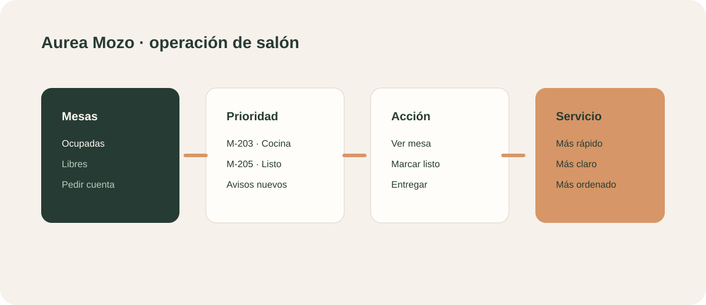

# Aurea Mozo

## Propuesta comercial

Una vista operativa pensada para celular que ayuda al equipo de salón a saber qué mesas están ocupadas, qué pedidos requieren atención y qué acciones siguen.

## Para quién es

Mozo, encargado de salón y equipos de atención de restaurantes con varias mesas activas.

## Qué incluye

- Mapa de mesas con estados.
- Total acumulado por mesa.
- Pedidos para atender ahora.
- Estados de cocina y entrega.
- Avisos del salón.
- Acceso rápido al gestor y menú público.
- Detalle de mesa al tocar una tarjeta.

## Demo

- Vista mobile-first: `#waiter`
- Mesa principal de prueba: Mesa 3

## Valor para el equipo

Reduce el tiempo de búsqueda, ordena prioridades y ofrece una interfaz de uso rápido durante el servicio.

## Próxima evolución

Actualización en tiempo real, asignación por mozo, notificaciones, comandas de cocina y acciones sobre mesas desde el mismo dispositivo.
