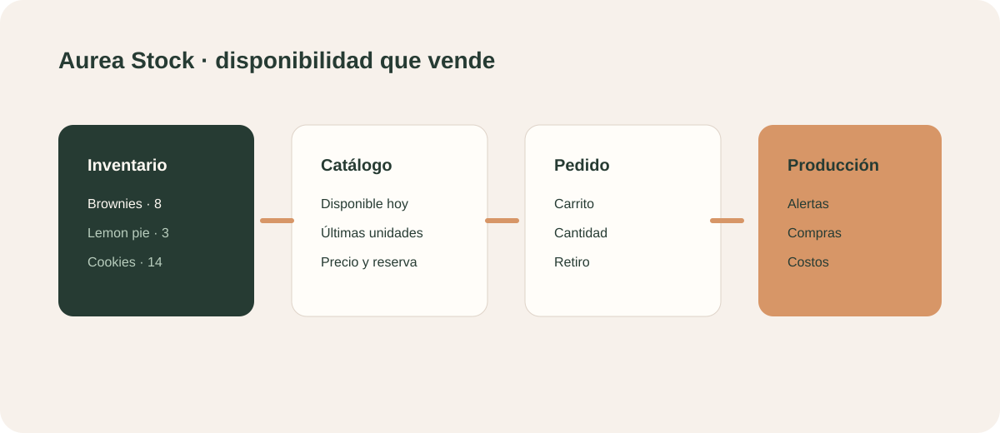

# Aurea Stock

## Propuesta comercial

Un catálogo simple para vender lo disponible hoy, controlar cantidades y convertir la disponibilidad real en pedidos o reservas.

## Para quién es

Panaderías, pastelerías, elaboradores, tiendas de productos artesanales y negocios que trabajan con tandas o inventario limitado.

## Qué incluye

- Catálogo público con productos y precios.
- Disponibilidad visible por producto.
- Alertas de últimas unidades.
- Carrito de reserva.
- Gestor con inventario, movimientos y producción.
- Registro de compras e ingresos de stock.
- Vista de productos publicados.

## Demo

- Catálogo público: `#stock`
- Gestor: `#admin-stock`

## Valor para el negocio

Evita vender productos agotados, comunica escasez de forma clara y reemplaza planillas aisladas por una experiencia de compra simple.

## Próxima evolución

Descuento automático de inventario, recetas y costos, proveedores, pagos, retiro, envíos y reportes de margen.
