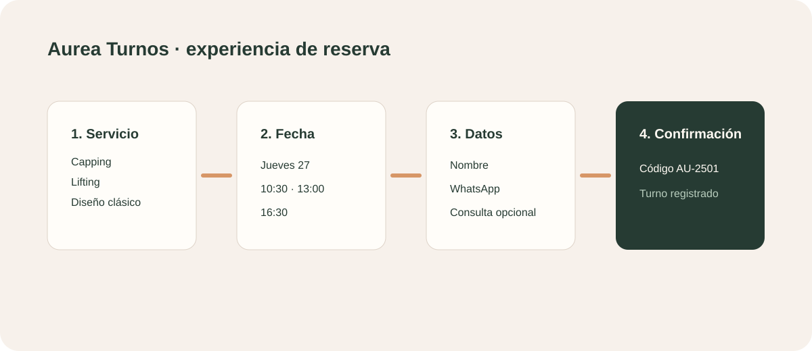

# Aurea Turnos

## Propuesta comercial

Una página de reservas simple y elegante para que un negocio reciba turnos sin depender de mensajes dispersos por WhatsApp.

## Para quién es

Profesionales independientes, estudios de belleza, peluquerías, centros de estética, consultorios y negocios que trabajan con agenda.

## Qué resuelve

- Presenta servicios, duración y precio en una página pública.
- Permite elegir servicio, fecha y horario.
- Captura los datos mínimos del cliente.
- Confirma la reserva con código identificador.
- Deja el turno registrado para la gestión interna.

## Experiencia incluida

1. El cliente entra desde un enlace.
2. Elige el servicio.
3. Selecciona fecha y horario.
4. Completa sus datos.
5. Recibe una confirmación.

## Demo

- Público: `#public`
- Gestor: `#admin`

## Valor para el negocio

Reduce la fricción para reservar, ordena la agenda y ofrece una presencia digital profesional sin requerir una tienda online completa.

## Próxima evolución

Disponibilidad real, autenticación, recordatorios, señas y pagos online, cancelaciones y sincronización con calendarios externos.
