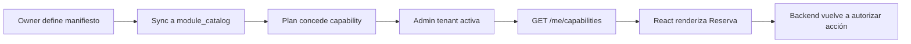
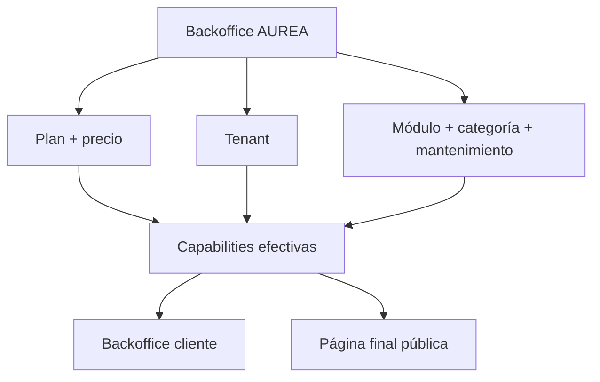
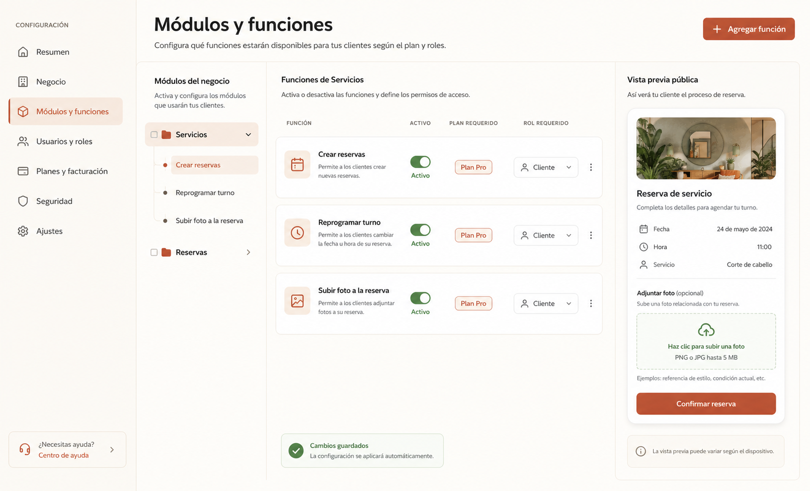

# POC — Módulos dinámicos por empresa

Esta POC valida la experiencia de seleccionar módulos y funciones para una empresa, manteniendo la misma jerarquía en catálogo, API y UI.

También fija el límite entre los dos productos administrativos de Aurea: el backoffice AUREA, orientado a la operación de la plataforma, y el backoffice del cliente, orientado a la operación de cada negocio.

## Objetivo

Demostrar tres escenarios:

1. un owner publica el catálogo `Servicios → Reservas → Subir foto a la reserva`;
2. un admin de tenant activa o desactiva la función si su plan la incluye;
3. la página React muestra u oculta el control, mientras el backend sigue protegiendo el endpoint.

## Flujos



## Alcance administrativo

### Backoffice AUREA

El owner puede:

- crear y editar planes/membresías;
- definir precio, moneda, intervalo, prueba y grace period;
- asignar módulos y funciones a cada plan;
- gestionar tenants y su estado;
- hacer ABM del catálogo de módulos y asignar categorías;
- activar o desactivar mantenimiento global;
- consultar auditoría.

El usuario `Readonly` puede consultar esas pantallas, pero cualquier mutación debe devolver `403 INSUFFICIENT_PERMISSION`.

### Backoffice del cliente

El cliente administra su negocio completo dentro del tenant elegido. Solo ve páginas, módulos y funciones que resultan habilitados por plan, configuración de tenant, estado global y rol. Las páginas finales se especializan por rubro, por ejemplo reservas para servicios, menú/pedidos para restaurante e inventario para stock.



## Mockup visual



El mockup es conceptual: sirve para conversar sobre jerarquía, estados, plan y preview. Los textos y estados reales deben venir de la API.

## Criterio de aceptación

- La pantalla agrupa por sección y página, sin mezclar features de dominios distintos.
- El admin ve por qué una función no está disponible: plan, rol, dependencia o estado.
- Activar una función actualiza el preview y el mapa de capabilities.
- Cambiar `tenantId` invalida la configuración anterior.
- Una llamada directa al endpoint sin capability devuelve `403`.
- La documentación de dominio mantiene las keys estables.

## Datos mínimos de demo

```json
{
  "plan": "pro",
  "tenant": "acme-salon",
  "enabled": [
    "services",
    "services.bookings",
    "services.bookings.create",
    "services.bookings.reschedule"
  ],
  "disabled": ["services.bookings.photo_upload"]
}
```

## Implementación incremental

### Fase 1 — contrato y datos

- Crear manifiestos de `services.bookings`.
- Seed de `module_catalog`, `plans`, `subscriptions`, `memberships` y `tenant_entitlements`.
- Implementar `resolveCapabilities(tenantId, userId, surface)`.

### Fase 2 — backoffice

- Árbol de sección/página/feature.
- Toggle con validación de plan, dependencias y rol.
- Audit log y preview público.

### Fase 3 — frontend y backend

- `useCapability` y `CapabilityRoute`.
- `requireCapability` en comandos sensibles.
- Tests de tenant cruzado y manipulación de JWT.

### Fase 4 — automatización

- Generación del snapshot desde manifests.
- Validación CI de keys, dependencias y rutas.
- Sincronización idempotente en deploy.

### Fase 5 — separación de backoffices

- Crear layouts y rutas de platform y tenant.
- Agregar guard de scope: `platform` versus `tenant`.
- Seed de roles `owner` y `readonly` para AUREA.
- Agregar mantenimiento global y pantalla de estado.
- Validar que un usuario de cliente no pueda consultar planes, precios ni otros tenants.

## Qué no debe resolver esta POC

- Billing real o integración con un proveedor de suscripciones.
- Editor genérico de workflows.
- Permisos por campo.
- Reglas de autorización offline.
- Borrado físico de features o datos históricos.
