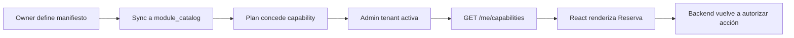

# POC — Módulos dinámicos por empresa

Esta POC valida la experiencia de seleccionar módulos y funciones para una empresa, manteniendo la misma jerarquía en catálogo, API y UI.

## Objetivo

Demostrar tres escenarios:

1. un owner publica el catálogo `Servicios → Reservas → Subir foto a la reserva`;
2. un admin de tenant activa o desactiva la función si su plan la incluye;
3. la página React muestra u oculta el control, mientras el backend sigue protegiendo el endpoint.

## Flujos



## Mockup visual


El mockup es conceptual: sirve para conversar sobre jerarquía, estados, plan y preview. Los textos y estados reales deben venir de la API.

## Criterio de aceptación

- La pantalla agrupa por sección y página, sin mezclar features de dominios distintos.
- El admin ve por qué una función no está disponible: plan, rol, dependencia o estado.
- Activar una función actualiza el preview y el mapa de capabilities.
- Cambiar `tenantId` invalida la configuración anterior.
- Una llamada directa al endpoint sin capability devuelve `403`.
- La documentación de dominio mantiene las keys estables.

## Datos mínimos de demo

```json
{
  "plan": "pro",
  "tenant": "acme-salon",
  "enabled": [
    "services",
    "services.bookings",
    "services.bookings.create",
    "services.bookings.reschedule"
  ],
  "disabled": ["services.bookings.photo_upload"]
}
```

## Implementación incremental

### Fase 1 — contrato y datos

- Crear manifiestos de `services.bookings`.
- Seed de `module_catalog`, `plans`, `subscriptions`, `memberships` y `tenant_entitlements`.
- Implementar `resolveCapabilities(tenantId, userId, surface)`.

### Fase 2 — backoffice

- Árbol de sección/página/feature.
- Toggle con validación de plan, dependencias y rol.
- Audit log y preview público.

### Fase 3 — frontend y backend

- `useCapability` y `CapabilityRoute`.
- `requireCapability` en comandos sensibles.
- Tests de tenant cruzado y manipulación de JWT.

### Fase 4 — automatización

- Generación del snapshot desde manifests.
- Validación CI de keys, dependencias y rutas.
- Sincronización idempotente en deploy.

## Qué no debe resolver esta POC

- Billing real o integración con un proveedor de suscripciones.
- Editor genérico de workflows.
- Permisos por campo.
- Reglas de autorización offline.
- Borrado físico de features o datos históricos.

