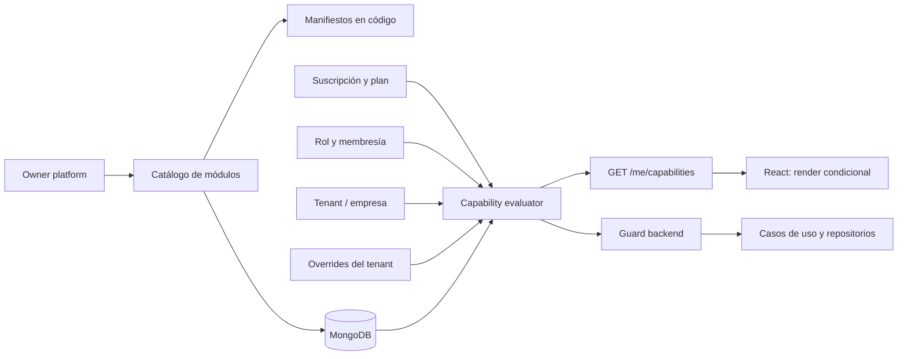
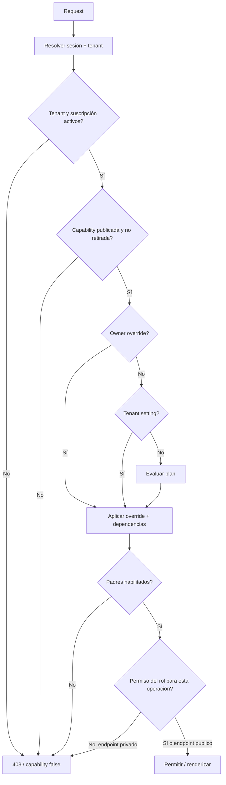
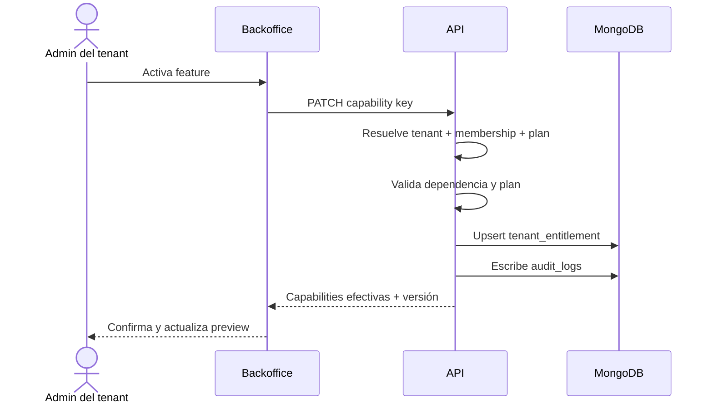

# Módulos dinámicos y capacidades por tenant

**Estado:** Propuesto para POC  
**Alcance:** configuración de producto, backoffice, API, backend, frontend y MongoDB  
**Decisión central:** el frontend puede ocultar o mostrar UI según las capacidades efectivas, pero el backend siempre vuelve a autorizar cada operación.

## 1. Problema y objetivo

Aurea Pages debe permitir que cada empresa elija qué partes de su producto quiere utilizar. Una capacidad se organiza en tres niveles:

```text
Sección: Servicios
└── Página: Reservas
    ├── Función: crear reserva
    ├── Función: reprogramar reserva
    └── Función: subir foto a la reserva
```

La misma jerarquía debe aparecer en:

- la configuración del backoffice;
- las carpetas y límites de dominio del backend;
- las rutas y componentes del frontend;
- la API que devuelve la configuración efectiva;
- la documentación y el catálogo administrado por los owners.

La recomendación es modelar el catálogo como datos versionados y establemente identificados por `key`, no como permisos inventados manualmente en cada pantalla. El catálogo puede descubrirse desde código durante el build o registrarse explícitamente mediante un manifiesto por módulo; MongoDB conserva la fuente operativa que determina qué puede usar cada empresa.

## 2. Vocabulario

| Concepto | Qué representa | Ejemplo |
| --- | --- | --- |
| `Section` | Agrupador de alto nivel visible en navegación y configuración | `services` |
| `Page` | Superficie o ruta funcional dentro de una sección | `services.bookings` |
| `Feature` | Capacidad concreta que puede habilitarse o bloquearse | `services.bookings.photo_upload` |
| `Module` | Unidad técnica desplegable que contiene páginas y features | `bookings` |
| `Plan` | Límite comercial que habilita un conjunto de capacidades | `pro` |
| `Role` | Permisos de una persona dentro del backoffice | `tenant_admin` |
| `Entitlement` | Regla que concede o deniega una capacidad a un tenant | `feature=...`, `effect=allow` |
| `Capability` | Resultado efectivo calculado para un tenant y un usuario | `services.bookings.photo_upload=true` |

`Module` es una unidad técnica/comercial; `Section`, `Page` y `Feature` son la jerarquía de navegación y configuración. No conviene usar el nombre de una ruta como permiso: las rutas cambian, las keys públicas deben ser estables.

## 3. Arquitectura recomendada



### Regla de confianza

El JWT identifica al usuario y puede contener `sub`, `sessionId` y una versión de sesión. No debe ser la fuente única de plan, roles o features. El backend resuelve en cada request —con caché breve si hace falta— el tenant actual, la membresía, el plan, los overrides y el estado de la cuenta.

El cliente puede modificar el JavaScript, llamar endpoints manualmente o enviar `feature=true`. Eso solo puede alterar la interfaz local; nunca debe conceder acceso.

## 4. Organización en el repositorio

La jerarquía de producto se refleja en el código sin crear un paquete por cada botón:

```text
packages/
  core/
    access/
      capability-catalog.ts
      capability-evaluator.ts
      require-capability.ts
    tenants/
    identity/
  bookings/
    services/
  customers/
  payments/
apps/
  api/
    modules/
      services/
        bookings/
          bookings.controller.ts
          bookings.service.ts
          features.ts
  web/
    src/
      sections/
        services/
          pages/
            bookings/
              BookingsPage.tsx
              features.ts
              components/
```

Cada módulo publica un manifiesto con la misma key que consume el backoffice:

```ts
export const bookingsManifest = {
  module: 'bookings',
  section: 'services',
  page: 'bookings',
  features: [
    { key: 'create', default: true, requiredPermissions: ['bookings:create'] },
    { key: 'photo_upload', default: false, requiredPermissions: ['bookings:write'] },
    { key: 'reschedule', default: true, requiredPermissions: ['bookings:write'] },
  ],
} as const;
```

La key completa se genera como `services.bookings.photo_upload`. El catálogo se valida en CI para detectar duplicados, features sin owner, rutas sin manifiesto o referencias a capabilities inexistentes.

## 5. Modelo MongoDB

Se recomienda separar catálogo global de configuración por tenant. Así se evita copiar el catálogo entero en cada empresa y se mantiene el aislamiento natural: las colecciones de configuración siempre llevan `tenantId`.

### 5.1 `tenants`

```js
{
  _id: ObjectId('...'),
  key: 'acme-salon',
  name: 'Acme Salon',
  status: 'active', // active | suspended | deleted
  timezone: 'America/Argentina/Buenos_Aires',
  subscriptionId: ObjectId('...'),
  createdAt: ISODate('2026-08-01T12:00:00Z'),
  updatedAt: ISODate('2026-08-20T12:00:00Z')
}
```

### 5.2 `module_catalog`

Catálogo global controlado por owners. No contiene datos propios de una empresa.

```js
{
  _id: ObjectId('...'),
  key: 'services.bookings.photo_upload',
  moduleKey: 'bookings',
  sectionKey: 'services',
  pageKey: 'bookings',
  kind: 'feature', // module | page | feature
  name: 'Subir foto a la reserva',
  description: 'Permite adjuntar una imagen desde la página de una reserva',
  status: 'active', // draft | active | deprecated | retired
  version: 1,
  dependencies: ['services.bookings'],
  requiredPermissions: ['bookings:write'],
  availability: {
    plans: ['pro', 'enterprise'],
    requiresSubscription: true
  },
  source: {
    ownerTeam: 'bookings',
    manifest: 'packages/bookings/features.ts',
    autoDiscovered: true
  },
  createdAt: ISODate('2026-08-01T12:00:00Z'),
  updatedAt: ISODate('2026-08-20T12:00:00Z')
}
```

El catálogo puede generarse automáticamente desde manifiestos en código y sincronizarse con un job idempotente. Los owners siguen aprobando el alta, el nombre comercial, el plan y el estado de publicación; automatizar el descubrimiento no significa permitir que código no revisado se active solo.

### 5.3 `plans`

```js
{
  _id: ObjectId('...'),
  key: 'pro',
  name: 'Pro',
  status: 'active',
  capabilityRules: [
    { key: 'services', effect: 'allow' },
    { key: 'services.bookings', effect: 'allow' },
    { key: 'services.bookings.photo_upload', effect: 'allow' },
    { key: 'payments', effect: 'deny' }
  ],
  limits: { bookingsPerMonth: 500, storageBytes: 1073741824 },
  version: 3,
  createdAt: ISODate('2026-08-01T12:00:00Z'),
  updatedAt: ISODate('2026-08-20T12:00:00Z')
}
```

Para catálogos grandes, `capabilityRules` puede normalizarse en `plan_entitlements`; para el POC embebido facilita leer el plan completo. El plan no debe ser editable por un usuario del tenant.

### 5.4 `subscriptions`

```js
{
  _id: ObjectId('...'),
  tenantId: ObjectId('...'),
  planKey: 'pro',
  status: 'active', // trialing | active | past_due | canceled
  currentPeriodStart: ISODate('2026-08-01T00:00:00Z'),
  currentPeriodEnd: ISODate('2026-09-01T00:00:00Z'),
  provider: { name: 'internal', customerRef: 'cus_123' },
  createdAt: ISODate('2026-08-01T12:00:00Z'),
  updatedAt: ISODate('2026-08-20T12:00:00Z')
}
```

### 5.5 `roles` y `memberships`

Los roles son globales o de plataforma; la pertenencia es siempre tenant-scoped.

```js
// roles
{
  _id: ObjectId('...'),
  key: 'operator',
  scope: 'tenant',
  permissions: ['bookings:read', 'bookings:write', 'customers:read'],
  managedBy: 'platform'
}

// memberships
{
  _id: ObjectId('...'),
  tenantId: ObjectId('...'),
  userId: ObjectId('...'),
  roleKeys: ['operator'],
  status: 'active',
  createdAt: ISODate('2026-08-02T10:00:00Z'),
  updatedAt: ISODate('2026-08-20T12:00:00Z')
}
```

Nunca se debe aceptar `tenantId` del body para decidir el tenant. Si el usuario administra varias empresas, el tenant activo sale de la sesión/subdominio y se comprueba contra `memberships`.

### 5.6 `tenant_entitlements`

Esta colección representa la elección de la empresa y los casos excepcionales aprobados por owners.

```js
{
  _id: ObjectId('...'),
  tenantId: ObjectId('...'),
  capabilityKey: 'services.bookings.photo_upload',
  effect: 'allow', // allow | deny
  source: 'tenant_setting', // plan | tenant_setting | owner_override | migration
  expiresAt: null,
  reason: 'Habilitado por el administrador de Acme',
  changedBy: ObjectId('...'),
  createdAt: ISODate('2026-08-20T12:00:00Z'),
  updatedAt: ISODate('2026-08-20T12:00:00Z'),
  version: 2
}
```

Un tenant puede desactivar una feature que su plan permite. No puede activar una feature que el plan no concede, salvo un `owner_override` explícito. El sistema debe materializar o calcular la cascada: si se desactiva `services`, todo lo que cuelga de esa sección queda inactivo aunque tenga un `allow` propio.

### 5.7 `audit_logs`

```js
{
  _id: ObjectId('...'),
  tenantId: ObjectId('...'), // null solo para acciones platform-scoped
  actor: { userId: ObjectId('...'), type: 'tenant_user' },
  action: 'capability.updated',
  target: { capabilityKey: 'services.bookings.photo_upload' },
  before: { effect: 'deny' },
  after: { effect: 'allow' },
  requestId: 'req_abc',
  createdAt: ISODate('2026-08-20T12:00:00Z')
}
```

## 6. Índices y aislamiento

```js
db.module_catalog.createIndex({ key: 1 }, { unique: true });
db.tenants.createIndex({ key: 1 }, { unique: true });
db.memberships.createIndex({ tenantId: 1, userId: 1 }, { unique: true });
db.tenant_entitlements.createIndex({ tenantId: 1, capabilityKey: 1 }, { unique: true });
db.tenant_entitlements.createIndex({ tenantId: 1, expiresAt: 1 });
db.subscriptions.createIndex({ tenantId: 1, status: 1 });
db.audit_logs.createIndex({ tenantId: 1, createdAt: -1 });
```

Toda consulta de negocio debe comenzar con el filtro de contexto:

```ts
bookings.find({ tenantId: auth.tenantId, _id: bookingId });
```

El repositorio debe recibir un `TenantContext` obligatorio para impedir consultas sin tenant por accidente. Se agregan pruebas de acceso cruzado para cada colección y endpoint.

## 7. Evaluación efectiva

### Precedencia

1. tenant suspendido o suscripción no válida: todo lo comercial queda denegado;
2. owner override explícito;
3. selección/deny del tenant;
4. regla del plan;
5. estado del catálogo y dependencias;
6. rol y permisos del usuario para operaciones privadas;
7. default del manifiesto solo si no existe una regla comercial.

La UI pública no debería depender del rol de backoffice. Para ella se calcula una vista pública de capabilities; para `/api/v1/admin/*` se agregan membership y permisos.



Pseudocódigo:

```ts
async function can(ctx: RequestContext, key: string, action?: string) {
  const catalog = await catalogRepo.get(key);
  if (!catalog || catalog.status !== 'active') return false;
  if (!ctx.tenant || ctx.tenant.status !== 'active') return false;
  if (!subscriptionAllows(ctx.subscription, catalog)) return false;

  const rule = await entitlementResolver.resolve(ctx.tenant.id, key, catalog);
  if (rule.effect !== 'allow') return false;
  if (!(await parentsAreEnabled(ctx.tenant.id, catalog))) return false;
  if (action && !ctx.permissions.includes(action)) return false;
  return true;
}
```

Para rendimiento, `resolveCapabilities` puede cargar catálogo + plan + overrides en paralelo, expandir padres e hijos en memoria y guardarse 30–60 segundos por `tenantId:userId:catalogVersion`. Al cambiar una configuración se invalida la caché de ese tenant.

## 8. API

### Capacidades efectivas

```http
GET /api/v1/me/capabilities?surface=public
Authorization: Bearer <session-token>
```

Respuesta sugerida:

```json
{
  "tenant": { "id": "...", "key": "acme-salon", "name": "Acme Salon" },
  "catalogVersion": 12,
  "capabilities": {
    "services": true,
    "services.bookings": true,
    "services.bookings.create": true,
    "services.bookings.photo_upload": false,
    "services.bookings.reschedule": true,
    "payments": false
  },
  "limits": { "bookingsPerMonth": 500, "storageBytes": 1073741824 },
  "generatedAt": "2026-08-20T12:00:00Z"
}
```

No devolver reglas internas, nombres de colecciones ni permisos de plataforma a una página pública. Para el backoffice puede existir `surface=admin`, con `source` y `reason` visibles a usuarios autorizados.

### Configuración del tenant

```http
GET   /api/v1/admin/capabilities/tree
PATCH /api/v1/admin/capabilities/:key
```

```json
{ "enabled": true }
```

El servidor valida que la key exista, que sea configurable por tenant, que el plan la permita y que la persona tenga `capabilities:manage`. Devuelve la configuración recalculada, no solo el documento escrito.

### Operaciones de negocio

```http
POST /api/v1/bookings/:id/photo
```

El endpoint ejecuta `requireCapability('services.bookings.photo_upload')` además de comprobar tenant, ownership del booking, tamaño/tipo del archivo y permiso de escritura. Ocultar el botón no reemplaza este guard.

## 9. Frontend React

El frontend carga capabilities una vez por contexto de tenant y las expone con un hook:

```tsx
const { enabled, loading } = useCapability('services.bookings.photo_upload');

if (loading) return <Skeleton />;
return enabled ? <BookingPhotoUpload bookingId={booking.id} /> : null;
```

Para páginas completas:

```tsx
<CapabilityRoute capability="services.bookings">
  <BookingsPage />
</CapabilityRoute>
```

El hook solo controla UX y navegación. Ante un `403 CAPABILITY_DISABLED`, la app refresca capabilities, muestra un mensaje neutro y no intenta “forzar” la operación.

La respuesta de capabilities no debe persistirse indefinidamente en `localStorage`: usar memoria, React Query o una caché con TTL corto y limpiar al cambiar de tenant.

## 10. Pantalla del backoffice

La pantalla recomendada es un árbol navegable:

```text
Módulos y funciones
├── Servicios                         [Sección activa]
│   ├── Reservas                      [Página]
│   │   ├── Crear reservas             [Activo]
│   │   ├── Reprogramar turno          [Activo]
│   │   └── Subir foto a la reserva    [Disponible en Pro · Inactivo]
│   └── Catálogo                       [Página]
├── Ventas
└── Operación
```

Cada fila debe mostrar: nombre, descripción breve, estado efectivo, plan requerido, dependencia faltante, quién lo cambió y fecha de actualización. Si el plan no lo permite, el control aparece bloqueado con CTA comercial; no debe parecer un error técnico.

Flujo de activación:



## 11. Descubrimiento automático del catálogo

La opción equilibrada es un registro híbrido:

1. cada módulo define un manifiesto tipado en su carpeta;
2. un script CI escanea manifiestos y genera un `catalog.snapshot.json`;
3. el deploy sincroniza el snapshot con `module_catalog` usando `upsert` por key;
4. los owners aprueban publicación y reglas comerciales desde un panel de plataforma;
5. retirar una feature la marca como `deprecated`/`retired`, nunca la borra si hay datos históricos.

Esto reduce duplicación entre código y admin, pero conserva control sobre precios, copy comercial y compatibilidad. No se recomienda inferir capabilities leyendo nombres de carpetas en runtime: es frágil, difícil de versionar y no expresa dependencias ni permisos.

## 12. Ciclo de vida y datos históricos

- Desactivar una página evita nuevas operaciones y la quita de navegación.
- Las reservas existentes permanecen accesibles a través de un flujo de migración o lectura mínima.
- Desactivar una feature de escritura no borra datos creados por ella.
- Una feature `retired` debe tener migración, reemplazo o política de solo lectura.
- Los cambios comerciales se auditan y tienen versión.
- Las dependencias se validan al desactivar: el sistema debe avisar qué páginas hijas quedarían inactivas.

## 13. Pruebas mínimas

| Caso | Resultado esperado |
| --- | --- |
| Tenant A llama recurso de tenant B | `404` o `403`, nunca datos |
| Usuario edita el JWT para agregar plan Pro | backend lo ignora |
| Plan Basic activa feature Pro | `409 CAPABILITY_NOT_INCLUDED` |
| Admin desactiva una página padre | hijos quedan efectivos en `false` |
| Feature desactivada llama endpoint directo | `403 CAPABILITY_DISABLED` |
| Rol operador abre pantalla permitida pero intenta administrar catálogo | `403 INSUFFICIENT_PERMISSION` |
| Suscripción vencida | features comerciales denegadas según grace period |
| Repetir PATCH con mismo payload | operación idempotente, un evento lógico |
| Cambiar de tenant en la misma sesión | se purga caché y se recalculan capacidades |
| Catálogo contiene key duplicada | CI/deploy falla antes de publicar |

## 14. Decisiones sugeridas para el POC

- Usar `tenantId` obligatorio en todas las colecciones de negocio.
- Mantener `module_catalog` global y `tenant_entitlements` por tenant.
- Resolver capacidades en backend y entregar un mapa plano al frontend.
- Definir precedencia explícita: override owner > setting tenant > plan > default, siempre respetando padres y estado del catálogo.
- Separar `capability` de `permission`: una empresa puede tener contratada una feature, pero un operador puede no tener permiso para administrarla.
- Empezar con manifiestos tipados y sincronización automática al deploy.
- Agregar caché breve e invalidación por tenant cuando el volumen lo justifique.

## 15. Pendientes antes de producción

1. Definir proveedor y estados exactos de suscripción.
2. Definir si un tenant puede tener varios planes/add-ons simultáneos.
3. Establecer grace period y comportamiento cuando vence un plan.
4. Definir si se permiten overrides temporales y quién los aprueba.
5. Definir qué features son públicas y cuáles solo de backoffice.
6. Elegir mecanismo de upload y límites de almacenamiento.
7. Acordar formato de errores y observabilidad de denegaciones.
8. Definir migraciones para módulos retirados.

