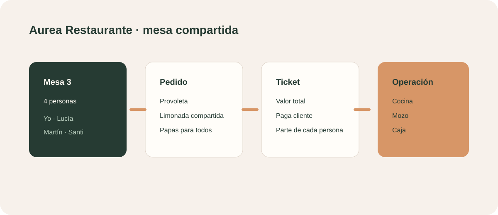
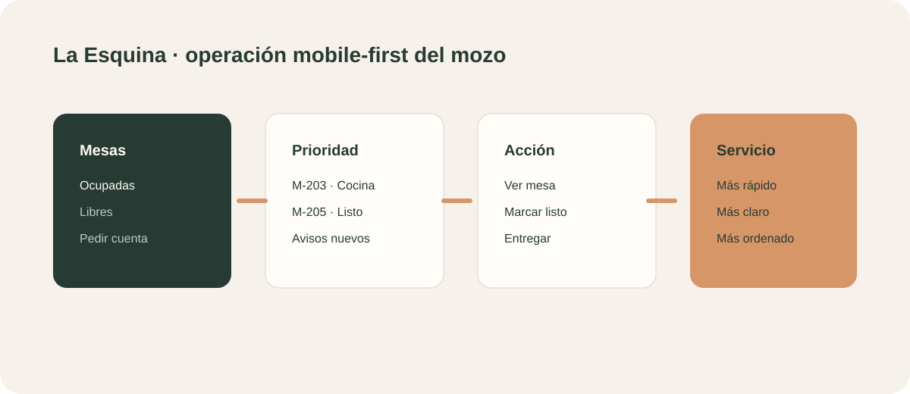

# Aurea Restaurante

## Propuesta comercial

Un menú digital conectado con la mesa para que cada persona pida desde su celular y el restaurante reciba pedidos claros, ordenados y listos para operar.

## Para quién es

Restaurantes, bares, cafeterías y espacios gastronómicos con mesas compartidas y necesidad de reducir errores al tomar pedidos.

## Qué incluye

- Menú digital por categorías.
- Mesa, nombre y cantidad de personas.
- Pedido individual, compartido entre participantes o para toda la mesa.
- Opción de sumarse al pedido de otra persona.
- Pedidos asociados a quien los cargó.
- Vista de pedidos de la mesa.
- Ticket con valor total y lo que paga cada cliente.
- Envío del pedido a cocina.
- Gestor de restaurante con pedidos, menú, clientes, pagos, caja y QR.

## Escenario de demo

La prueba está preparada para la mesa 3 con cuatro personas: Yo, Lucía, Martín y Santi. Incluye provoleta, limonada compartida, papas para la mesa, burger, ravioles y copa de la casa.

## Flujo de cliente

1. Entra al menú desde el QR.
2. Indica su nombre y mesa.
3. Agrega platos.
4. Decide si cada ítem es individual o compartido.
5. Puede ver los pedidos y sumarse a otro.
6. Consulta el ticket final.
7. Envía el pedido a cocina.

## Demo

- Menú público: `#restaurant`
- Gestor: `#admin-restaurant`
- Vista mozo integrada: `#waiter`

## Vista mozo integrada

La vista Mozo es parte del mismo producto Restaurante. No se presenta como una solución independiente: usa el contexto de La Esquina y complementa el flujo con una operación mobile-first para mesas, pedidos, avisos y entregas.

Incluye:

- Mapa de mesas y estados.
- Pedidos para atender.
- Avisos del salón.
- Detalle de una mesa.
- Acceso al gestor y al menú público.

## Valor para el restaurante

Mejora la toma de pedidos, reduce confusiones, facilita el consumo compartido y libera al equipo para concentrarse en la atención.

## Próxima evolución

Sincronización multi-dispositivo real, cocina en tiempo real, impresión de comandas, pagos, cierre de mesa, propinas, reservas y analítica.

## Código del ejemplo

- [Dominio y datos de La Esquina](src/restaurant-example.js)
- La demo ejecutable actual se abre desde `apps/web/#restaurant`, `#admin-restaurant` y `#waiter`.
