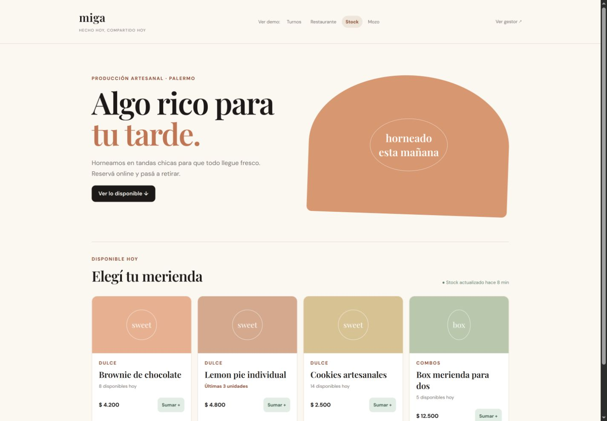

# Aurea Stock

## Propuesta comercial

Un catálogo simple para vender lo disponible hoy, controlar cantidades y convertir la disponibilidad real en pedidos o reservas.

## Venta

### Speech comercial

“Aurea Stock te permite vender lo que realmente tenés disponible. Tus clientes ven el catálogo actualizado, saben qué queda y pueden reservar sin preguntarte producto por producto. Vos controlás el inventario, detectás qué reponer y convertís una planilla interna en una experiencia de compra clara.”

### Qué hace

Publica productos con precio y disponibilidad, alerta cuando quedan pocas unidades, permite armar una reserva y ofrece al negocio una vista de inventario, movimientos y producción.

### Por qué el cliente lo necesita

Porque vender sin controlar el stock genera pedidos imposibles de cumplir y clientes frustrados. La solución evita sobreventas, comunica la escasez a tiempo y ayuda a producir y reponer con mejores datos.

## Para quién es

Panaderías, pastelerías, elaboradores, tiendas de productos artesanales y negocios que trabajan con tandas o inventario limitado.

## Qué incluye

- Catálogo público con productos y precios.
- Disponibilidad visible por producto.
- Alertas de últimas unidades.
- Carrito de reserva.
- Gestor con inventario, movimientos y producción.
- Registro de compras e ingresos de stock.
- Vista de productos publicados.

## Demo

- Catálogo público: `#stock`
- Gestor: `#admin-stock`

## Valor para el negocio

Evita vender productos agotados, comunica escasez de forma clara y reemplaza planillas aisladas por una experiencia de compra simple.

## Próxima evolución

Descuento automático de inventario, recetas y costos, proveedores, pagos, retiro, envíos y reportes de margen.

## Código del ejemplo

- [Dominio y datos de Stock](src/stock-example.js)
- La demo ejecutable actual se abre desde `apps/web/#stock` y `#admin-stock`.
